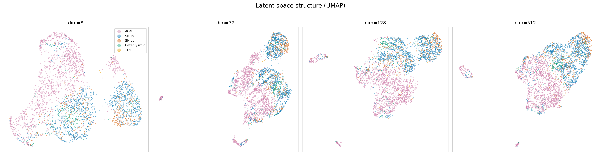
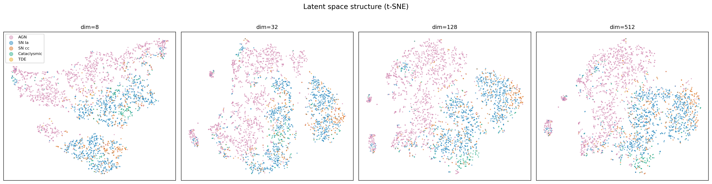

# RTF: Real-time Transient Fingerprints

Latent-space compression of astronomical alert streams using transformer autoencoders. Encodes variable-length multi-band light curves into compact fixed-length fingerprints that preserve astrophysically meaningful information.

Part of the [BOOM](https://github.com/boom-astro) project and the [AppleCiDEr](https://github.com/applecider-ml) pipeline.

## Motivation

LSST will produce ~10M alerts/night. Current brokers filter this to a small subset, discarding most of the stream. RTF compresses the full alert stream into fixed-length latent vectors, enabling:

- **Alert distribution at ~1 MBps** (streaming HD video bandwidth) instead of the full ~100 MBps raw stream
- **Similarity search** via cosine distance in latent space
- **Anomaly detection** via reconstruction error
- **Downstream classification** from latent vectors without access to raw data

## Approach

We train transformer-based autoencoders on ~18K labeled ZTF transient light curves. The encoder ingests up to four modalities:

| Modality | Channels | Description |
|---|---|---|
| **Photometry** | 7 | log1p(dt), log1p(dt_prev), logflux, logflux_err, one-hot band (g/r/i) |
| **Alert metadata** | +30 | Star/galaxy scores, PSF shape, real/bogus, nearest source properties |
| **Cutout stamps** | (3, 63, 63) | Most recent science/template/difference image via CNN |
| **GP features** | +114 | Physics-based features from [lightcurve-fitting](https://github.com/boom-astro/lightcurve-fitting) GP fitter |

The encoder compresses all modalities into a fixed-length latent vector (e.g., 64 floats = 256 bytes). A decoder reconstructs the photometry, and an optional classification head jointly classifies the source.

### Architecture comparison

Three bottleneck types are compared (AE wins):

| Architecture | Bottleneck | Result |
|---|---|---|
| **AE** (autoencoder) | Deterministic projection | **Best reconstruction + classification** |
| VAE (variational) | Gaussian + KL divergence | KL penalty hurts both metrics |
| VQ-VAE (vector quantized) | 512-entry codebook | Plateaus at ~80% (codebook bottleneck) |

### Image tower

Two backends for processing alert cutout stamps:

| Backend | Params | Description |
|---|---|---|
| `simple` | ~260K | 4-layer CNN, trained from scratch |
| `zoobot` | ~8.5M | Galaxy Zoo pretrained ConvNeXt-pico ([Zoobot](https://huggingface.co/mwalmsley/zoobot-encoder-convnext_pico)) |

The Zoobot backbone processes the most recent alert stamp (upsampled 63→224px) and adds the image embedding to the CLS token. It can be frozen or fine-tuned.

## Results

### Early classification: accuracy vs detection count

A single model trained with random truncation [3, L] is evaluated at each fixed detection count. This simulates real-time classification as alerts accumulate.

**Zoobot fine-tuned + metadata + GP + joint classification (dim=64, 256 bytes/alert):**

| N detections | Accuracy | Balanced acc | ROC-AUC |
|---|---|---|---|
| 3 | 84.1% | 57.7% | 0.921 |
| 5 | 85.7% | 58.7% | 0.923 |
| 10 | 85.7% | 58.7% | 0.935 |
| 20 | 85.8% | 59.3% | 0.937 |
| 50 | 86.7% | 60.0% | 0.943 |
| 100 | 87.0% | 60.6% | 0.943 |
| all | 87.4% | 61.7% | 0.946 |

Compared to metadata + GP only (no images):

| N detections | meta+GP acc | Zoobot acc | Delta | meta+GP bal | Zoobot bal | Delta |
|---|---|---|---|---|---|---|
| 3 | 79.5% | **84.1%** | +4.6pp | 44.9% | **57.7%** | **+12.8pp** |
| 5 | 79.8% | **85.7%** | +5.9pp | 45.2% | **58.7%** | **+13.5pp** |
| 10 | 80.7% | **85.7%** | +5.0pp | 46.6% | **58.7%** | +12.1pp |
| 50 | 83.1% | **86.7%** | +3.6pp | 52.0% | **60.0%** | +8.0pp |
| all | 84.2% | **87.4%** | +3.2pp | 54.0% | **61.7%** | +7.7pp |

**Galaxy Zoo pretrained images are the single most valuable modality addition**, especially at early detections where photometry is sparse but stamps show host morphology. The joint classification loss (`--cls-weight 0.5`) is also critical for pushing class-discriminative information into the latent space.

### Reconstruction quality in physical units

The AE reconstructs light curves to sub-0.2 mag accuracy at moderate compression (photometry-only model):

| Dim | Bytes | Compression | Mag (median) | Time error (days) | Band acc |
|-----|-------|-------------|-------------|-------------------|----------|
| 8 | 32B | 225x | 0.19 | 3.5 | 70.7% |
| **64** | **256B** | **28x** | **0.16** | **2.5** | **73.3%** |
| 256 | 1024B | 7x | 0.16 | 2.5 | 73.6% |

Adding modalities improves reconstruction further:

| Input modality | Recon MSE | Band acc |
|---|---|---|
| Photometry only | 0.26 | 62.7% |
| + metadata | 0.13 | 65.0% |
| + meta + GP | 0.089 | 68.3% |
| + meta + Zoobot + GP | 0.10 | 71.3% |

### Architecture comparison — AE vs VAE vs VQ-VAE

Coarse 5-class linear probe accuracy (photometry only):

| Dim | AE | VAE | VQ-VAE |
|-----|-----|-----|--------|
| 8 | **82.6%** | 77.0% | 77.4% |
| 64 | **86.5%** | 84.3% | 78.7% |
| 256 | **88.4%** | 86.8% | 80.0% |

### Latent space visualization

UMAP projections of the AE latent space at increasing dimensions (8 → 32 → 128 → 512), colored by coarse transient class:





### Key findings

1. **Galaxy Zoo pretrained images add +13pp balanced accuracy** at early detections (N=3), making stamps the most valuable modality for rare class identification (TDE, SN subtypes).

2. **A single model handles any detection count** — random truncation during training produces a universal encoder that works from N=3 to full light curve.

3. **Joint classification + reconstruction** (`--cls-weight 0.5`) pushes class-discriminative information into the latent vector, improving downstream classification without sacrificing reconstruction.

4. **The plain autoencoder (AE) outperforms VAE and VQ-VAE** at every dimension — the KL penalty hurts without compensating benefit for compression.

5. **GP features from lightcurve-fitting (0.2ms/source) match CNN image processing for reconstruction** — the GP encodes the same morphological information as the stamps.

6. **Reconstruction saturates at dim ~64** (0.16 mag median, 256 bytes/alert). Classification continues improving to dim ~512.

7. **87.4% accuracy from 256 bytes** — approaches the full XGBoost pipeline (94.4%) which uses 128 hand-crafted features + catalog cross-matches.

### Classes

**Coarse (5-class):** SNIa, SNcc, Cataclysmic, AGN, TDE

**Fine (10-class):** SN Ia, SN Ib, SN Ic, SN II, SN IIP, SN IIn, SN IIb, Cataclysmic, AGN, TDE

### Data

- 18,245 labeled ZTF transients from the AppleCiDEr sample
- Train: 12,771 / Val: 2,737 / Test: 2,737
- Photometry from raw ZTF alert packets (`alerts.npy`), with 30 candidate metadata fields
- Cutout stamps: science/template/difference (63x63 px) per alert
- GP features: 114-dim vector from lightcurve-fitting (computed on the fly during preprocessing)
- Pre-processed via `preprocess_alerts.py` into compact NPZ for fast training

## Usage

### Preprocessing

```bash
# Convert raw alerts to compact NPZ with images + GP features
python src/preprocess_alerts.py \
    --alert-dir /path/to/data_ztf \
    --splits /path/to/splits.csv \
    --labels-dir /path/to/photo_events \
    --output-dir data_gp \
    --fit-gp \
    --workers 32
```

### Training

```bash
cd src

# Best model: Zoobot + metadata + GP + joint classification + random truncation
python train.py \
    --data-dir ../data_gp \
    --output-dir ../runs \
    --mode ae \
    --use-metadata \
    --use-images --image-backbone zoobot \
    --use-gp --gp-dim 114 \
    --cls-weight 0.5 --num-classes 5 \
    --random-truncate --min-detections 3 \
    --latent-dims 64 \
    --epochs 200

# Photometry-only baseline
python train.py \
    --data-dir /path/to/photo_events \
    --output-dir ../runs \
    --mode ae \
    --latent-dims 64 \
    --epochs 200
```

### Evaluation

```bash
# Early classification: accuracy vs detection count
python eval_early.py \
    --checkpoint ../runs/model_name/best_model.pt \
    --summary ../runs/model_name/summary.json \
    --data-dir ../data_gp \
    --output-dir ../analysis/early \
    --image-backbone zoobot --num-classes 5 \
    --detection-counts 3 5 7 10 15 20 30 50 100

# Linear probe classification
python linear_probe.py --runs-dir ../runs --output-dir ../analysis

# Physical-unit reconstruction metrics
python evaluate_physical.py --runs-dir ../runs --data-dir /path/to/photo_events \
    --output-dir ../analysis/physical
```

### Tests

```bash
pip install pytest pytest-cov
pytest tests/ -v  # 71 tests
```

## Architecture

```
Input modalities:
  Photometry (L, 7)  ──→ Linear(in_ch, 128) + Time2Vec ──→ sequence tokens
  Metadata (L, 30)   ──→ (concatenated with photometry)
  Image (3, 63, 63)  ──→ ImageTower (CNN or Zoobot) ──→ added to CLS token
  GP features (114)  ──→ Linear(114, 128) ──→ added to CLS token

Encoder:
  TransformerEncoder(4 layers, 8 heads, 512 FFN, dropout=0.3)
  CLS token → LayerNorm → bottleneck

Bottleneck:
  AE:     Linear(128, latent_dim)
  VAE:    (mu_proj, logvar_proj) → reparameterize
  VQ-VAE: VectorQuantizer(512 codes, EMA)

Classification head (optional):
  Linear(latent_dim, latent_dim) → ReLU → Linear(latent_dim, num_classes)

Decoder:
  Linear(latent_dim, 128) → broadcast to 257 positions + pos embed
  TransformerEncoder(2 layers)
  head_cont: Linear(128, 4)  → MSE loss
  head_band: Linear(128, 3)  → CE loss
```

## File structure

```
rtf/
├── src/
│   ├── model.py              # LightCurveCompressor + ImageTower
│   ├── dataset.py            # AlertDataset, MetaNPZDataset, PhotoNPZDataset
│   ├── train.py              # Training loop with all modality flags
│   ├── preprocess_alerts.py  # alerts.npy → compact NPZ with images + GP
│   ├── eval_early.py         # Accuracy vs detection count evaluation
│   ├── linear_probe.py       # Linear probe classification
│   ├── mlp_decoder.py        # MLP decoder classifiers
│   ├── evaluate_physical.py  # Mag-space metrics + light curve plots
│   ├── visualize.py          # UMAP/t-SNE latent space plots
│   ├── generate_surveysim.py # Synthetic data via survey-sim
│   └── generate_synthetic.py # Synthetic data via parametric models
├── tests/                    # 71 unit/integration tests
├── slurm/                    # OzSTAR job scripts
├── .github/workflows/ci.yml  # GitHub Actions CI (pytest + ruff)
├── pyproject.toml
├── runs/                     # Trained models (gitignored)
└── analysis/                 # Results + plots (gitignored)
```
